# Gauss Circle Lattices with Geometric Convolutions for Synthesizing High Dimensional Image-Source Room Impulse Responses

The image-source model (ISM) is a widely adopted method for efficiently simulating acoustic room impulse responses (RIRs) under specular reflection assumptions. Acoustic paths between source and receiver are traced to lattice points computed from successive reflections over bounding planes of the room. Rectangular rooms bound the total number of image-sources to be polynomial in the RIR's duration or distance $k$ equivalent, with degree equal the number of room dimensions $N$. Direct ISM simulations are therefore compute upper-bound by $O \left ( k^N \right )$, and consider only cases of $N \leq 3$ for tractability and real-world applications.

This Matlab repository contains an alternative computational method that lowers the asymptotic compute bound to $O \left ( N k^2  \log k \right )$ for integer coordinates and room dimensions via reducing ISM lattice point counting to the classic Gauss circle problem (GCP). We extend the lattice counting model to frequency-dependent and reflection weighted image-sources in higher dimensions, relating solutions between successive dimensions via the convolution operator. Two constructions for realizing RIRs are presented, along with time-frequency controls, error and run-time analysis, and RIR statistics.

## Gauss Circle Problem (GCP) Lattice Counting

The classic $\textrm{GCP}(k, N)$ counts the number of integers in $\mathbf{\nu} \in \mathcal{Z}^N$ upper-bounded by the Euclidean norm $||\mathbf{\nu}||_2 \leq k$ for distance $k$. For efficient counting in $N$ dimensions, we can express the solution in terms of summations over solutions in $N-1$ dimensions given by  
  
$$\textrm{GCP}(k, N) = \left\lbrace \begin{aligned} & \qquad 1 + 2 \lfloor k \rfloor, && \qquad N = 1\newline \sum_{m = -\lfloor k \rfloor}^{\lfloor k \rfloor } &  \textrm{GCP}(\sqrt{k^2 - m^2}, N-1), && \qquad  N > 1\end{aligned}\right. .$$

As a result, computing GCP in high-dimensions has an elegant recurrence relation, and can be memoized for integers $k^2 - m^2$ to yield a dynamic programming solution for $k \in \mathcal{Z}_{\geq 0}$. Furthermore, solutions for varying $k$ can be expressed via convolution operator between a sparse square-kernel and the preceding solutions in the lower dimensions. The following functions implement this formulation.

### Functions

| File | Description|
| --- | --- |
|GCP_direct.m| Reference (brute-force) method|
|GCP_direct_recur.m| Recurrence relation|
|GCP_DP.m| Dynamic programming|
|GCP_conv.m | Convolution reformulation|

### Sample Runtime Comparisons For Varying Distance $k$ and Dimensions $N$

Small distance $k \leq 100$, and small dimension $N=3$:

```
k = 0:100;
N = 3;
tic; c_direct = GCP_direct(k, N); toc
tic; c_direct_recur = GCP_direct_recur(k, N); toc
tic; c_DP = GCP_DP(k, N); toc
tic; c_conv = GCP_conv(k, N); toc

err_recur = norm(c_direct - c_direct_recur)
err_DP = norm(c_direct - c_DP)
err_conv = norm(c_direct - c_conv)

figure; semilogy(k, c_direct, '-', k, c_direct_recur, ':', k, c_DP, '.-', k, c_conv, '--', 'linewidth', 2); grid on; axis tight;
h_lg = legend('Direct', 'Direct Recur', 'DP', 'Conv', 'location', 'best'); set(h_lg, 'fontsize', 13)
xlabel('Distance k', 'fontsize', 14);
ylabel('Count', 'fontsize', 14); 
title(['Gauss Circle Problem N = ', num2str(N)], 'fontsize', 16);
% exportgraphics(gcf, 'figs/GCP_small_k_small_N.png')
```
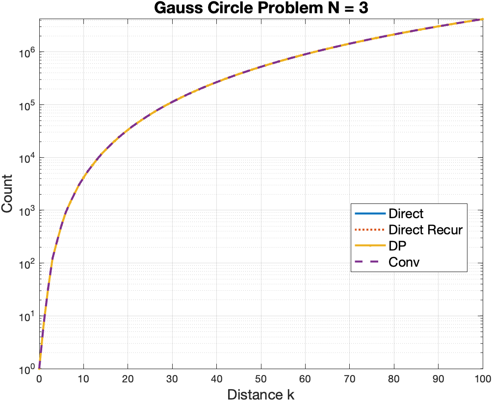

Small distance $k \leq 12$, and large dimension $N = 20$:

```
k = 0:12;
N = 20;
tic; c_DP = GCP_DP(k, N); toc
tic; c_conv = GCP_conv(k, N, 'conv'); toc
err = norm(c_DP - c_conv)

figure; semilogy(k, c_DP, '-', k, c_conv, '--', 'linewidth', 2); grid on; axis tight;
h_lg = legend('DP', 'Conv', 'location', 'best'); set(h_lg, 'fontsize', 13)
xlabel('Distance k', 'fontsize', 14);
ylabel('Count', 'fontsize', 14); 
title(['Gauss Circle Problem N = ', num2str(N)], 'fontsize', 16);
% exportgraphics(gcf, 'figs/GCP_small_k_large_N.png')
```
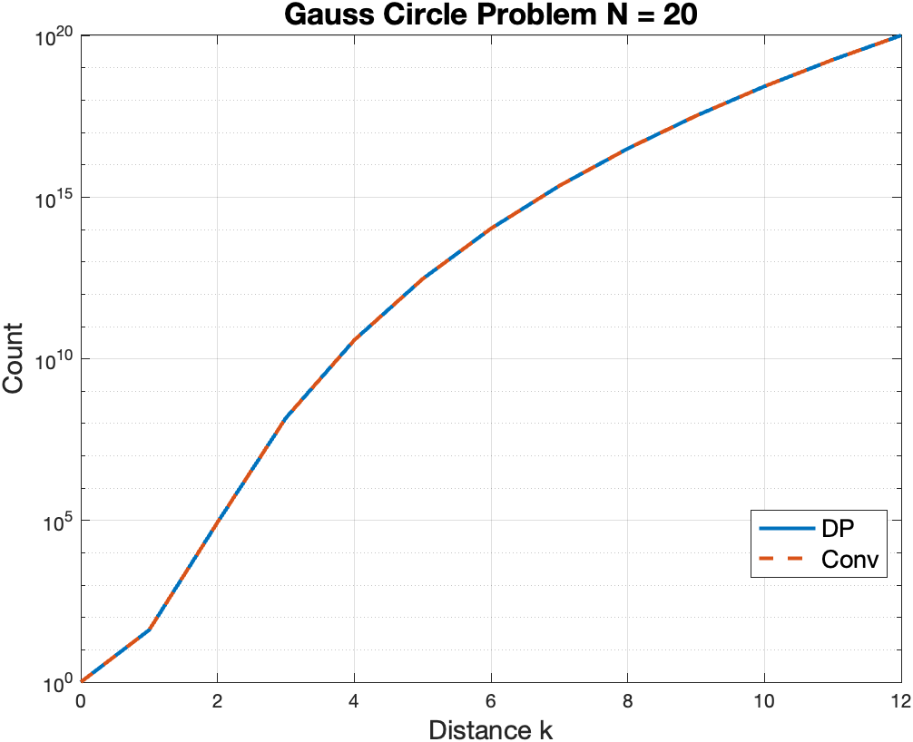

Large distance  $k \leq 500$, and small dimension  $N \leq 5$:

```
k = 0:500;
N = 5;
tic; c_DP = GCP_DP(k, N); toc
tic; c_conv = GCP_conv(k, N, 'conv'); toc
err = norm(c_DP - c_conv)

figure; semilogy(k, c_DP, '-', k, c_conv, '--', 'linewidth', 2); grid on; axis tight;
h_lg = legend('DP', 'Conv', 'location', 'best'); set(h_lg, 'fontsize', 13)
xlabel('Distance k', 'fontsize', 14);
ylabel('Count', 'fontsize', 14); 
title(['Gauss Circle Problem N = ', num2str(N)], 'fontsize', 16);
% exportgraphics(gcf, 'figs/GCP_large_k_small_N.png')
```
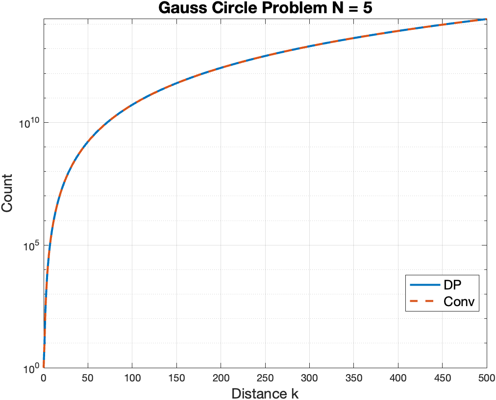

Large distance  $k \leq 500$, and large dimension $N = 20$:

```
k = 0:500;
N = 20;
tic; c_DP = GCP_DP(k, N); toc
tic; c_conv = GCP_conv(k, N, 'conv'); toc
err = norm(c_DP - c_conv)

figure; semilogy(k, c_DP, '-', k, c_conv, '--', 'linewidth', 2); grid on; axis tight;
h_lg = legend('DP', 'Conv', 'location', 'best'); set(h_lg, 'fontsize', 13)
xlabel('Distance k', 'fontsize', 14);
ylabel('Count', 'fontsize', 14); 
title(['Gauss Circle Problem N = ', num2str(N)], 'fontsize', 16);
% exportgraphics(gcf, 'figs/GCP_large_k_large_N.png')
```
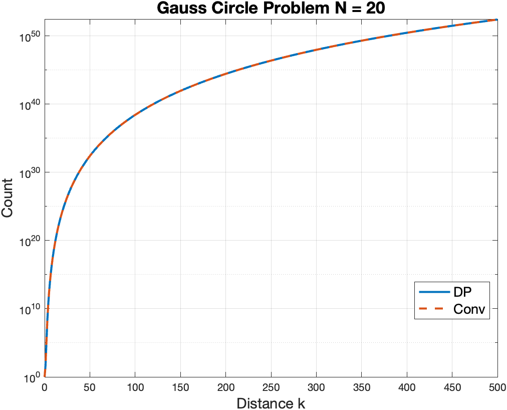

## Gauss Circle Problem Image-Source Model (GCP-ISM) for Room Impulse Response (RIR) Generation

We extend GCP for RIR generation by considering the classic ISM paper by
> J.B. Allen and D.A. Berkley, "Image method for efficiently simulating small‐room acoustics," The Journal of the Acoustical Society of America. 1979 Apr 1;65(4):943-50.

The RIR under ISM is a summation of acoustic path contributions in directions of the a sound-source repeatedly reflected over orthogonal planes of a room. Imaged sound-sources have coordinates that can be expressed in terms of translations over scaled lattice coordinates. Acoustic attenuation from wall reflections can be expressed in terms of weighted summation. We can therefore weight GCP summations and modify its integration bounds to compute the total acoustic path contributions as a function of distance $k$. Differentiating the latter volume function yields the RIR.

Please see the [publications](#Publications) section for further details.

### Functions

GCP-ISM volume functions:
| File | Description|
| --- | --- |
|GCP_ISM_direct.m| Reference solution|
|GCP_ISM_recur.m|Recurrence relation|
|GCP_ISM_DP.m| Dynamic programming|
|GCP_ISM_conv.m|Convolution reformulation|

RIR construction functions:
| File | Description|
| --- | --- |
|RIR_ISM_direct.m|Reference ISM|
|RIR_GCP_ISM_LUT.m|GCP-ISM with frequency-independent wall reflection|
|RIR_GCP_ISM_LUT_freq.m|GCP-ISM with frequency-dependent wall reflections|

### RIR Comparisons for Increasing Room Dimensions

Sample code for generating RIRs for 1, 2, 3, 4, 5, 6 dimensional rooms via look-up-table (LUT) inverse-construction methods:
```
% Define source location per dimension (meters)
s_full         = [1,    0,      1,  	0,     1,	3];

% Define receiver location per dimension (meters)
r_full         = [2,    1,      1,  	3,     2,	2];

% Define room size per dimension (meters)
l_full         = [5,    4,      3,  	7,     6,	8];

% Define wall reflection coefficients per dimension (magnitude of intensity reflected)
gamma_pos_full = [0.93, 0.8,  0.9,	0.93,   0.77,	0.82];
gamma_neg_full = [0.72, 0.78, 0.93,	0.67,   0.52,	0.7];

% Define total simulation distance (seconds)
T = 0.3;

% Number of room dimensions
N = numel(s_full);	

% Volume computation mode 'DP', 'conv'
mode = 'conv';

% lambda coordinate scaling
lambda = 1;

% RIR construction method 'forward', 'inverse'
direction = 'inverse';

% Direct method upto time (seconds)
T_direct = 0;

% Generate RIRs for increasing number of room dimensions
h_GCP_ISM_cell = cell(1, N);
for n = 1:N
	ndims = 1:n;  %Simulate for subset of dimensions  

	% Store RIR in cell array
	h_GCP_ISM_cell{n} = RIR_GCP_ISM_LUT(T, s_full(ndims), r_full(ndims), l_full(ndims), gamma_pos_full(ndims), gamma_neg_full(ndims), ...
    		'mode', mode, 'lambda', lambda, 'direction', direction, 'T_direct', T_direct, 'enable_disp', true);

  	% exportgraphics(gcf, ['figs/GCP_ISM_N_', num2str(n), '.png'])
end
```
| N = 1 | N = 2 | N = 3 |
| --- | --- | --- |
|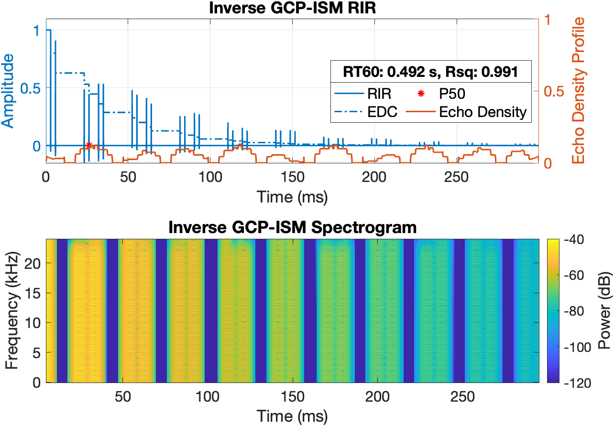|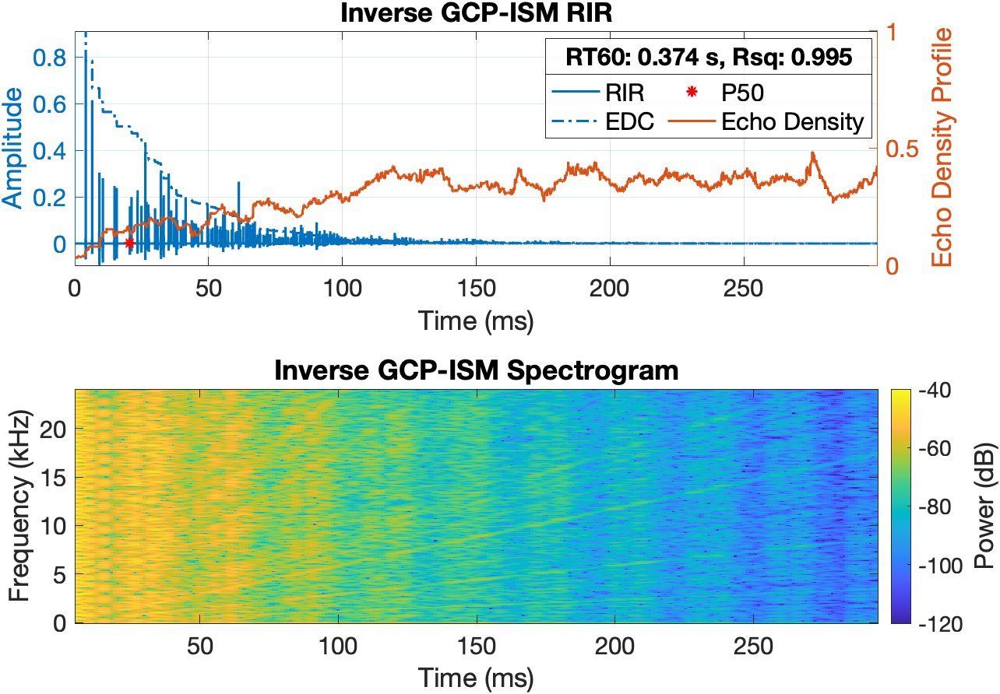|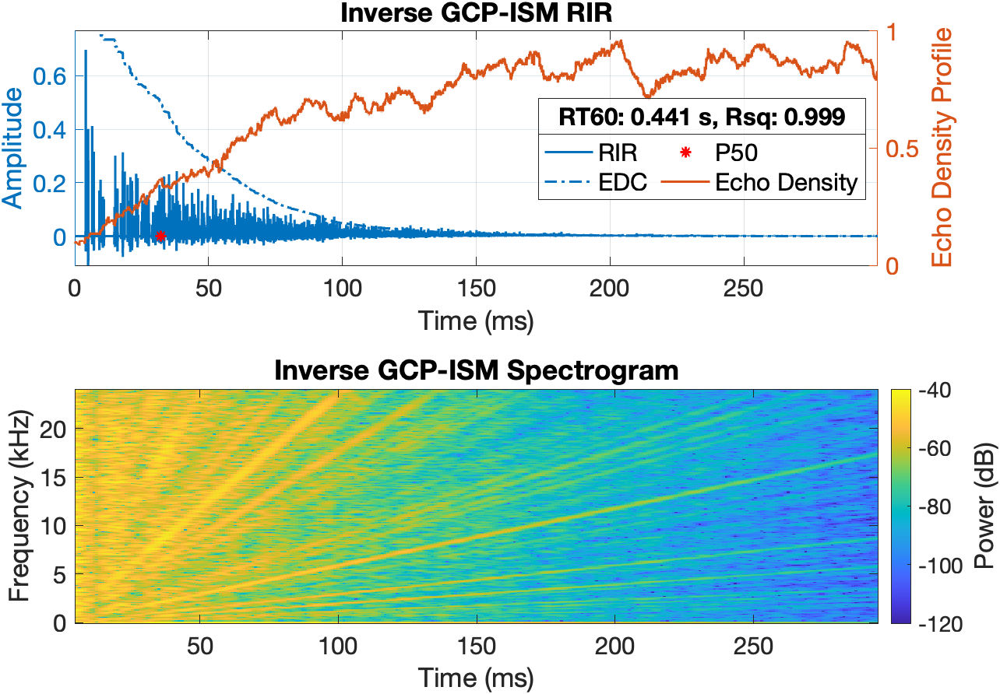|

| N = 4 | N = 5 | N = 6 |
| --- | --- | --- |
|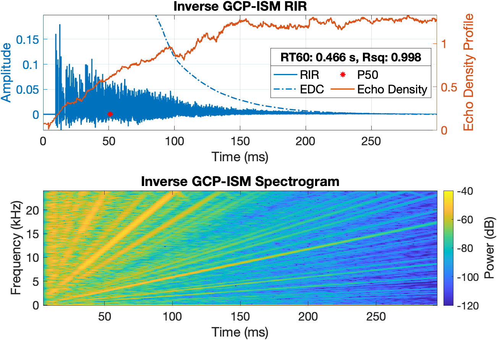|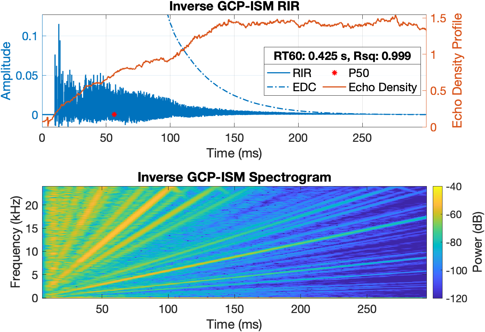|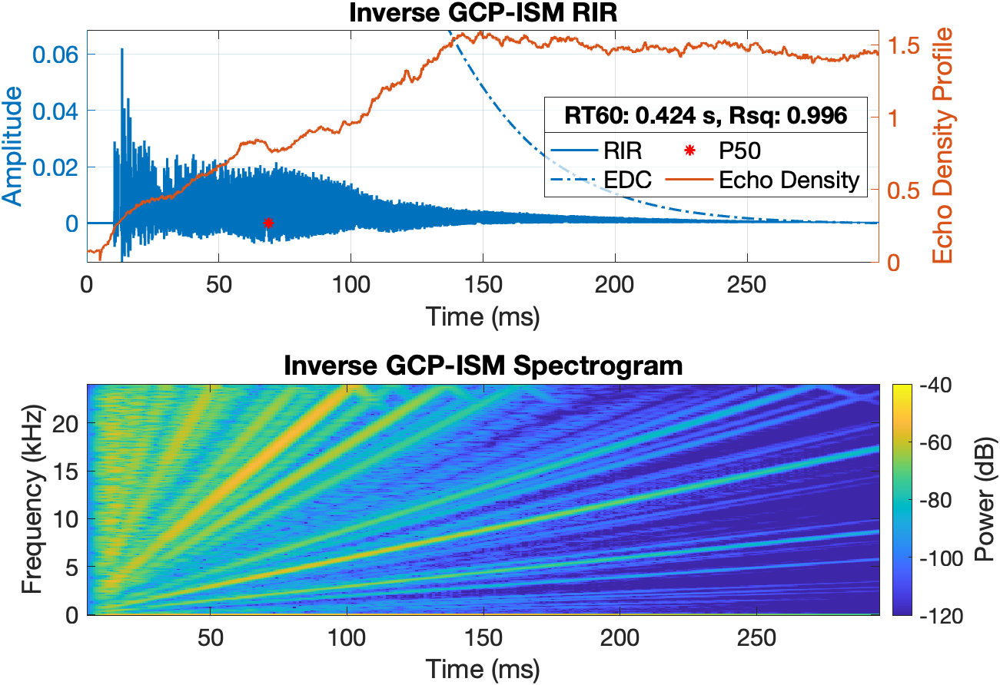|

For correctness, we can show that GCP-ISM matches direct ISM (see paper for runtime comparisons):
```
% Generate direct ISM RIR for N = 3
ndims = 1:3;
h_direct = RIR_ISM_direct(T, s_full(ndims), r_full(ndims), l_full(ndims), gamma_pos_full(ndims), gamma_neg_full(ndims), 'enable_disp', true);
% exportgraphics(gcf, ['figs/direct_ISM_N_', num2str(3), '.png'])
```
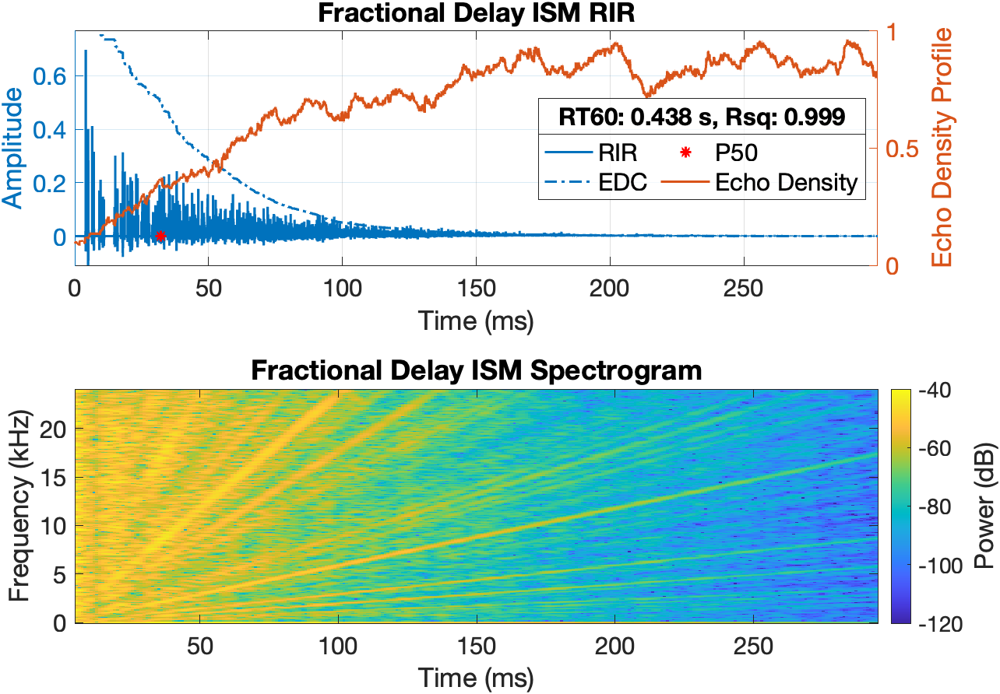

### Modifying Wall Reflection Coefficients
We can consider wall reflection coefficients $\Gamma_{\pm n}$ with negative impedances (180 degree phase-inversion) for breaking up the regularity of acoustic reflections along  $\pm$ axis aligned walls that belong to the room’s $n^{th}$ dimension.

```
ndims = 1:6;
varargin = {'mode', mode, 'lambda', lambda, 'direction', direction, 'T_direct', T_direct, 'enable_disp', true, 'clim', [-160, -40], 'RT60_dB_hi', -20, 'RT60_dB_lo', -40};

% Phase-flip both +- facing wall reflections coefficients
h_refl_neg_neg = RIR_GCP_ISM_LUT(T, s_full(ndims), r_full(ndims), l_full(ndims), -gamma_pos_full(ndims), -gamma_neg_full(ndims), varargin{:});
% exportgraphics(gcf, ['figs/GCP_ISM_N_', num2str(6), '_refl_neg_neg.png'])

% Phase-flip + facing wall reflections coefficients
h_refl_neg_pos = RIR_GCP_ISM_LUT(T, s_full(ndims), r_full(ndims), l_full(ndims), -gamma_pos_full(ndims), gamma_neg_full(ndims), varargin{:});
% exportgraphics(gcf, ['figs/GCP_ISM_N_', num2str(6), '_refl_neg_pos.png'])

% Phase-flip alternating wall reflections coefficients
h_refl_alt_flip = RIR_GCP_ISM_LUT(T, s_full(ndims), r_full(ndims), l_full(ndims), gamma_pos_full(ndims) .* (-1).^((ndims) + 0), gamma_neg_full(ndims) .* (-1).^((ndims) + 1), varargin{:});
% exportgraphics(gcf, ['figs/GCP_ISM_N_', num2str(6), '_refl_alt_flip.png'])
```
| $-\Gamma_{+n}$, $-\Gamma_{-n}$ | $-\Gamma_{+n}$, $\Gamma_{-n}$  | $(-1)^n   \Gamma_{+n}$, $(-1)^{n+1} \Gamma_{-n}$ |
| --- | --- | --- |
|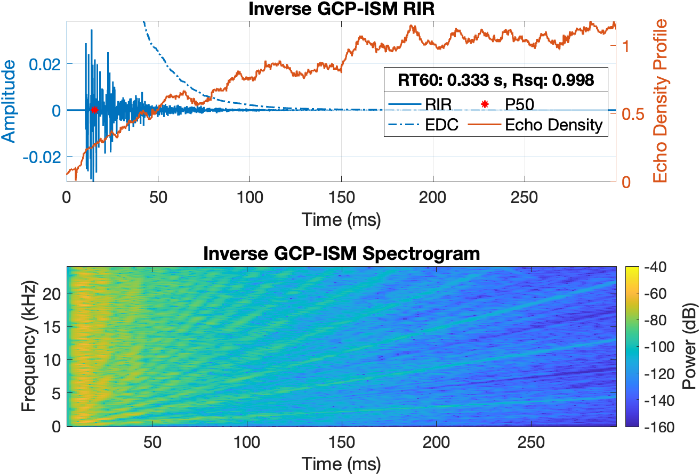|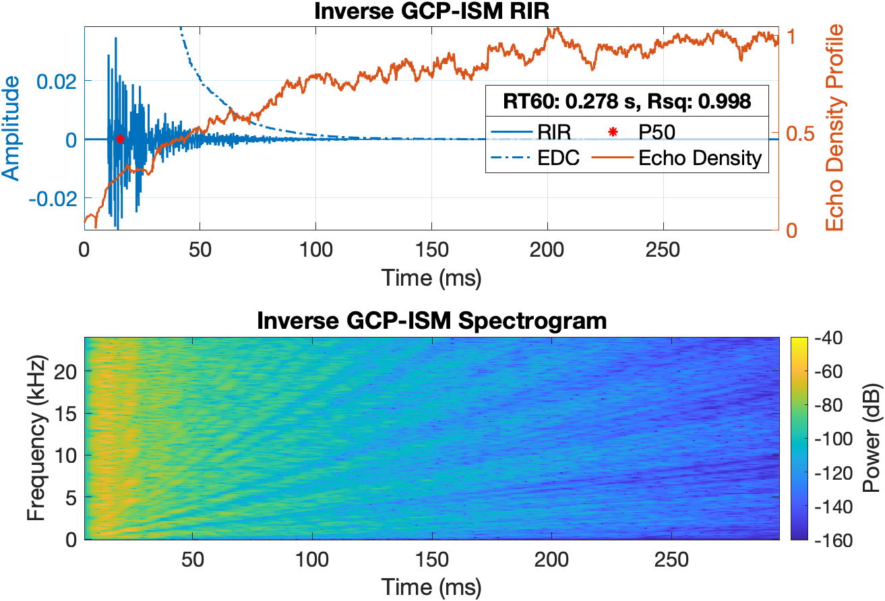|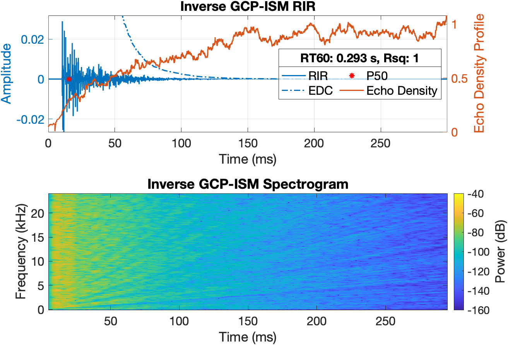|


### Frequency Dependent Wall Reflections

GCP-ISM supports frequency-dependent wall reflection coefficients, which can be specified by the latter’s frequency response at uniform spaced frequency bins from DC to Nyquist. It’s useful to design a minimum phase filter interpolating some set of desired amplitude responses over frequency, and constrained to be below or at unity. For example, a 2-tap minimum phase filter with monotone magnitude response over frequency can be parameterized by the desired magnitude responses at DC and Nyquist. An 8-tap minimum phase filter with a non-monotonic amplitude response is also designed and its RIR shown. Note that higher-order filters require their frequency responses to be sampled over higher number of uniform spaced frequency points.

```
ndims = 1:3;

% Specify number of frequency points between DC and Nyquist
P = 17;
w = linspace(0, pi, P)';

% Design two-tap minimum phase filter with target response at DC and Nyquist
h_refl_2 = filter_two_tap_FIR(0, -2.5, false);
H_refl_2 = freqz(h_refl_2, 1, [w; pi]); H_refl_2 = H_refl_2(1:end-1);

% Specify frequency responses per wall
gamma_pos_freq_2 = H_refl_2 * gamma_pos_full;
gamma_neg_freq_2 = H_refl_2 * gamma_neg_full;

h_GCP_ISM_cpx_refl_2 = RIR_GCP_ISM_LUT_freq(T, s_full(ndims), r_full(ndims), l_full(ndims), gamma_pos_freq_2(:, ndims), gamma_neg_freq_2(:, ndims), ...
    		'mode', 'ifft', 'lambda', lambda, 'enable_disp', true);
% exportgraphics(gcf, ['figs/GCP_ISM_freq_2_N_', num2str(3), '.png'])


% Increase number of frequency points between DC and Nyquist for 8-tap wall reflection FIR filter
P = 129;
w = linspace(0, pi, P)';

% Design 8-tap minimum phase filter
X_mag_oneside = db2mag([0, -3.5,  -2, -4]);
h_refl_8 = filter_min_phase([X_mag_oneside, fliplr(X_mag_oneside)], 1, false);
H_refl_8 = freqz(h_refl_8, 1, [w; pi]); H_refl_8 = H_refl_8(1:end-1);

% Specify frequency responses per wall
gamma_pos_freq_8 = H_refl_8 * gamma_pos_full;
gamma_neg_freq_8 = H_refl_8 * gamma_neg_full;

h_GCP_ISM_cpx_refl_8 = RIR_GCP_ISM_LUT_freq(T, s_full(ndims), r_full(ndims), l_full(ndims), gamma_pos_freq_8(:, ndims), gamma_neg_freq_8(:, ndims), ...
    		'mode', 'ifft', 'lambda', lambda, 'enable_disp', true);
% exportgraphics(gcf, ['figs/GCP_ISM_freq_8_N_', num2str(3), '.png'])

% Plot wall reflection filter responses
figure; hz_disp = logspace(log10(20), log10(24000), 256);
H_refl_2_disp = freqz(h_refl_2, 1, hz_disp, 48000);
H_refl_8_disp = freqz(h_refl_8, 1, hz_disp, 48000);
semilogx(hz_disp, mag2db(abs(H_refl_2_disp)), hz_disp, mag2db(abs(H_refl_8_disp)), 'linewidth', 1.5); grid on; axis tight;
xlabel('Frequency (Hz)', 'fontsize', 14); ylabel('Magnitude (dB)', 'fontsize', 14); title('Wall Reflection Filter Response', 'fontsize', 15); h_lg = legend('2-tap FIR', '8-tap FIR', 'location', 'best'); set(h_lg, 'fontsize', 13); set(gca, 'fontsize', 13)
% exportgraphics(gcf, ['figs/GCP_ISM_freq_wall_refl_resp.png'])

```
|GCP-ISM RIR with 2-tap Wall Reflection Filter |GCP-ISM RIR with 8-Tap Wall Reflection FIR | Wall Reflection Responses|
| --- | --- | --- |
|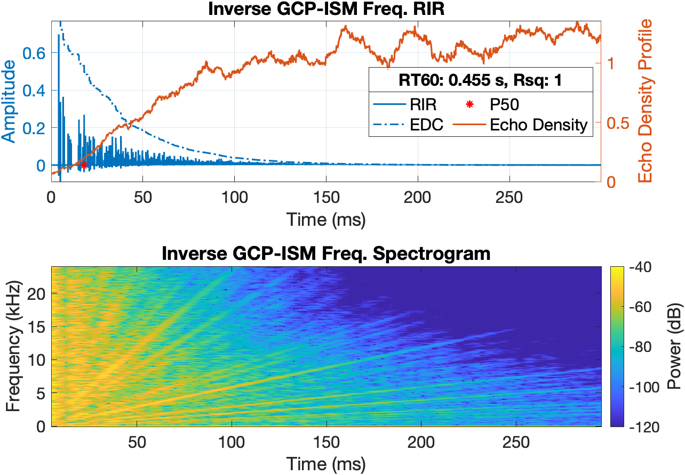|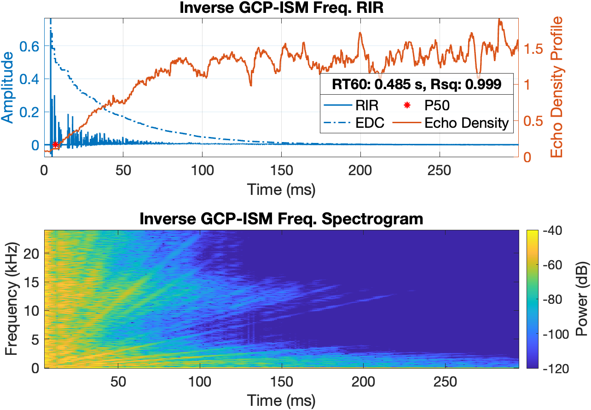|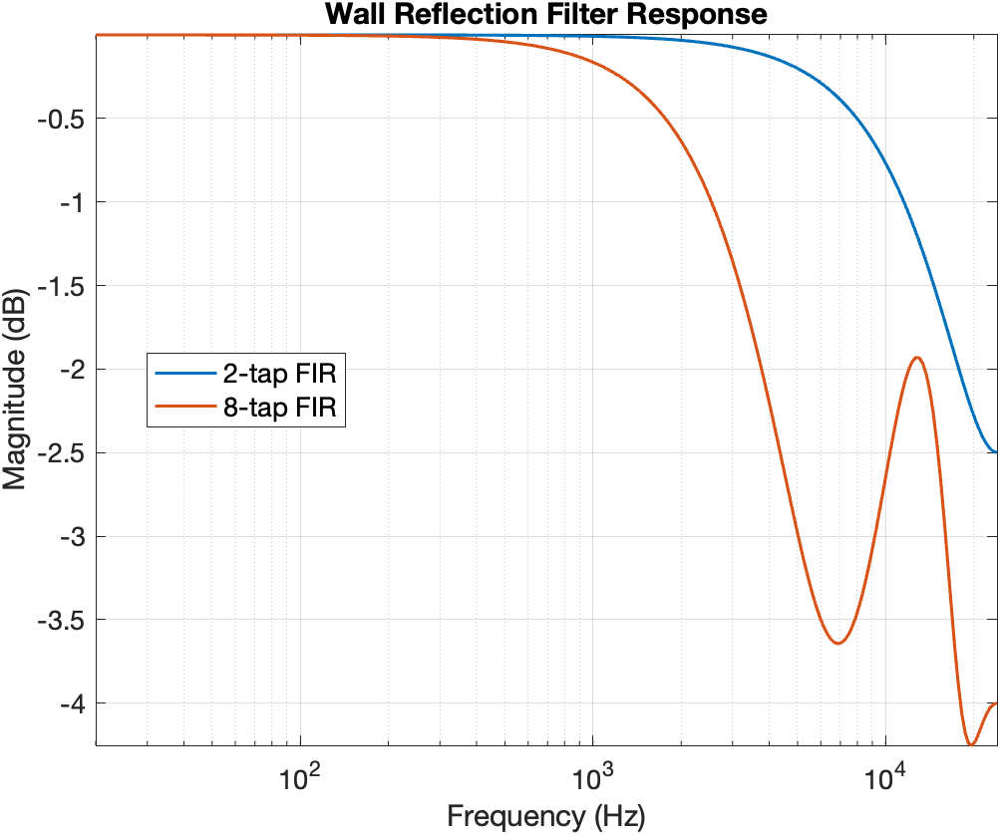|

### Adding Randomized Coordinate Jitter

GCP-ISM supports image-source coordinate jittering that is separable across dimensions. The regularity of image-source coordinates and induces sweeping echos and sweep streaks in the spectrogram. In the direct ISM method, adding a jitter to image-sources' coordinates significantly reduces the sweep effects. For GCP-ISM, we can jitter the span of the signed distances between image-sources to the receiver when integrating over the lower dimensional slices. This also reduces the sweep effects, but not to the extent of independent and identically distributed sampling per coordinate; GCP image-source jitters remain separable across dimension. Increasing the coordinate scaling factor lambda also increases the distance resolution for resolving small jitter coordinate bounds.

```
ndims = 1:3;

% Image-source coordinates are sampled from a uniform distribution between [jitter_coord_bnd(1), jitter_coord_bnd(2)]
jitter_coord_bnd = [-1e-1, 1e-1]; % Within +- 10 cm

h_direct_jit 	= RIR_ISM_direct(T, s_full(ndims), r_full(ndims), l_full(ndims), gamma_pos_full(ndims), gamma_neg_full(ndims), 'enable_disp', true, 'jitter_coord_bnd', jitter_coord_bnd);
% exportgraphics(gcf, ['figs/direct_ISM_jit_N_', num2str(3), '.png'])

h_GCP_ISM_jit 	= RIR_GCP_ISM_LUT(T, s_full(ndims), r_full(ndims), l_full(ndims), gamma_pos_full(ndims), gamma_neg_full(ndims), ...
			'mode', mode, 'lambda', 1, 'jitter_coord_bnd', jitter_coord_bnd, 'direction', direction, 'T_direct', T_direct, 'enable_disp', true);
% exportgraphics(gcf, ['figs/GCP_ISM_jit_N_', num2str(3), '.png'])

h_GCP_ISM_4_jit	= RIR_GCP_ISM_LUT(T, s_full(ndims), r_full(ndims), l_full(ndims), gamma_pos_full(ndims), gamma_neg_full(ndims), ...
			'mode', mode, 'lambda', 4, 'jitter_coord_bnd', jitter_coord_bnd, 'direction', direction, 'T_direct', T_direct, 'enable_disp', true);
% exportgraphics(gcf, ['figs/GCP_ISM_4_jit_N_', num2str(3), '.png'])
```
| Direct ISM with Jitter | GCP-ISM with Jitter $(\lambda=1)$ | GSP-ISM with Jitter $(\lambda=4)$|
| --- | --- | --- |
|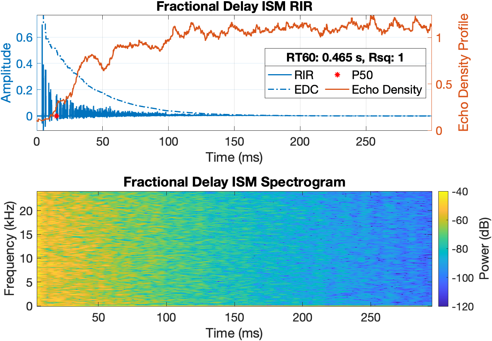||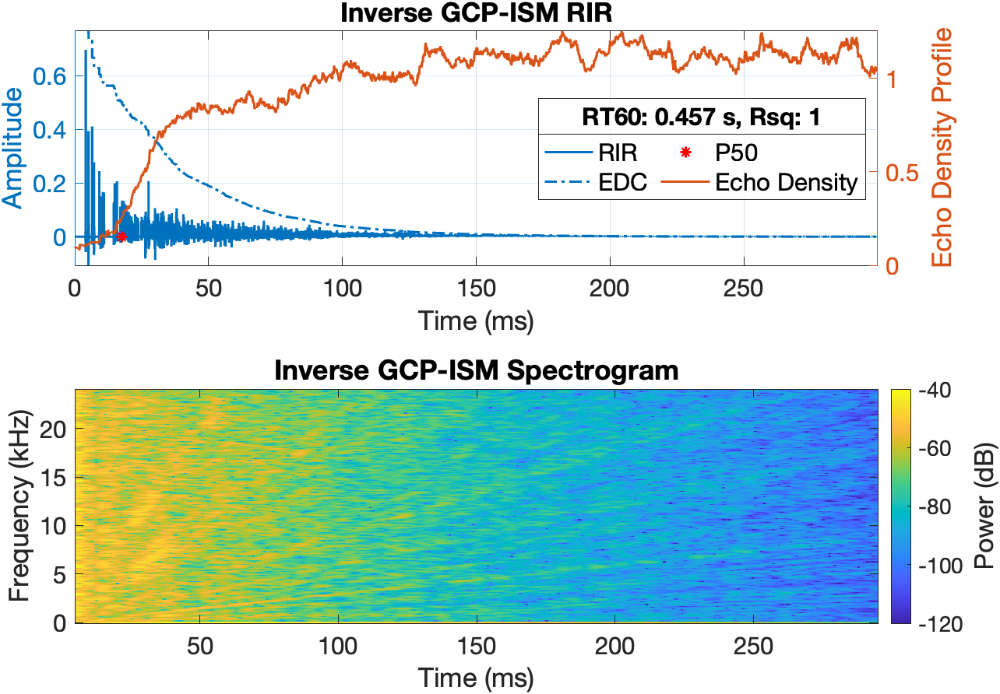|

## Publications

If you use this package for your work, please cite the following:

>Y. Luo, "Gauss Circle Lattices with Geometric Convolutions for Synthesizing High Dimensional Image-Source Room Impulse Responses", 29th International Conference on Digital Audio Effects. DAFx, 2026.

## Other Implementations

An earlier implementation was developed for <a href = "https://nuspaceaudio.com/2017/02/07/riviera-fast-hybrid-reverb-plugin-for-modeling-high-dimensional-spaces/" target="_blank">Riveria</a> (free VST/AU plugin) at my company <a href="https://nuspaceaudio.com/" target=“_blank”>NuSpace Audio</a> in 2017. In fact, the original theoretical work was documented in a series of <a href="https://nuspaceaudio.com/2017/02/13/geometric-audio-2-gauss-circle-problem-for-integer-room-models/" target=“_blank”>blog posts</a>, and was only recently completed for academic publishing after a long hiatus.

## License
> GCP-ISM (c) by Yuancheng Luo
>
>GCP-ISM is licensed under a
Creative Commons Attribution 4.0 International License.
>
>You should have received a copy of the license along with this
work. If not, see <https://creativecommons.org/licenses/by/4.0/>.